# Introduction

TypeScript stands in an unusual relationship to JavaScript. TypeScript offers all of JavaScript’s features, and an additional layer on top of these: TypeScript’s type system.

For example, JavaScript provides language primitives like string and number, but it doesn’t check that you’ve consistently assigned these. TypeScript does.

This means that your existing working JavaScript code is also TypeScript code. The main benefit of TypeScript is that it can highlight unexpected behavior in your code, lowering the chance of bugs.

Typescript build on top of javascript with multiple benefits.

## Benefits

1. static typing

In static typing we know the type of variable in development envirenment and can not be re-declair during runtime.

2. code completion
3. refactoring
4. shortand notations

When we write the code we set the type of variable or functions and then we tell the compiler to convert these typescript files back to javascript for browser understanding.
When we compile our code the compiler stops right at the line where type is wrong so we can not check our code each time on browser.

## Drawbacks

Typescript has some drawbacks along aside benefits

### Transpilation

We have a **compiler** all the time to convert .ts to .js for browser support.
This process is called transpilation.

### Disciplne code

We always follows the rules for writing ts code which is kind of annoying.

# Configuring Typescript

## tsc --init

1. target: 'es2016'
2. module: 'commonjs'
3. rootDir: './src'
4. outDir: './dist'
5. removeComments: true
6. noEmitOnError: true

## Data Types

Typescript is very strict about checking data types. There are very usefull data types in typescript;

1. Any of Type

   When we do not assign any initial value to the variable by default it is **type any** we should always avoid of type any.

   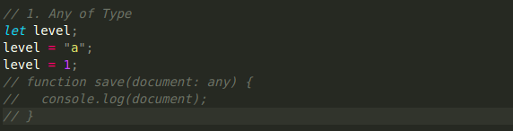

2. Arrays

   Another usefull data types used in typescript.

   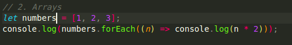

3. Tuples

   This type is usefull for pair of values.
   **RECOMMENDED**: use two values only for better use

   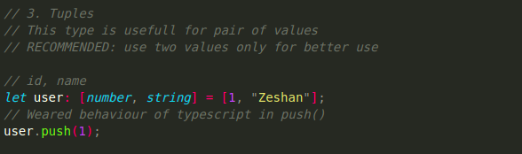

4. Enums (enum Pascal)

   We can define multiple cases of a constant with enums

   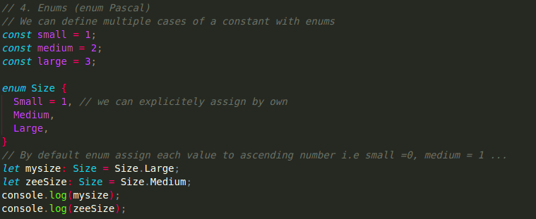

5. Functions

   In this type we should be take care of many things;

   1. Args types, number of args, unused args(config), return type, implicit return(config), localstorage, default value, localValue unused(config)
   2. config settings => "noUnusedParameters": true, "noImplicitReturns": true, "noUnusedLocals": true

   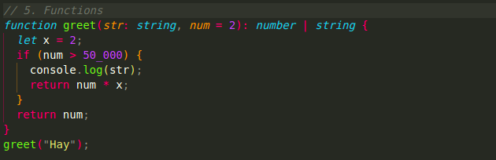

6. Objects

   In this type we should be take care of many things;

   properties types, initial values, readonly attribute, optional values

   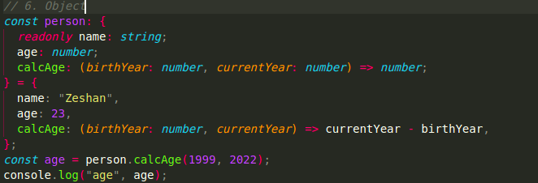

### Problems with Object Types:

- Anotation of obj harder to read
- Makes code more complicated
- Dublication possible for multiple obj with same properties

7. Aliases

   Aliases are used to clone the specific code that are used in multiple places and that's overcome the problems of object types.

   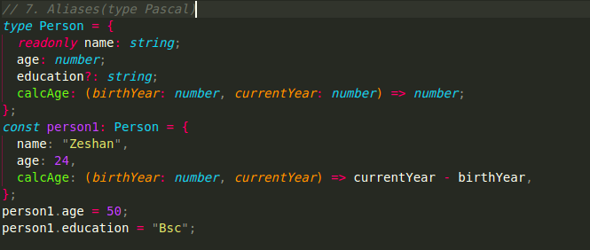

8. Union(|) and Intersection(&)

   Unions are used for adding two or more types while Intersections are used for making two data types in one

   

9. Literal Types

   When we limit a value for a specific or exact value we use literals

   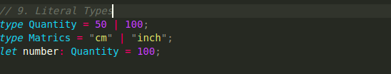

10. Nullify types

    In this type we can set a function return a null value as per requirement

    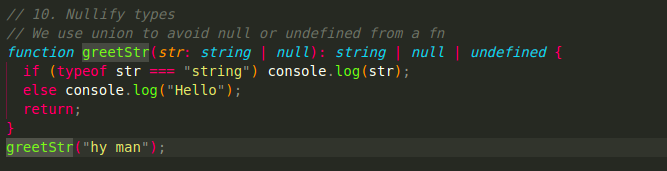

11. Optional Chaining

    Another usefull technique for chaining multiple data types

    

12. Unknown types

    Unknown types is prefered on **any** type because we will do some sort of type checking/narrowing down in order to apply some functionality.

    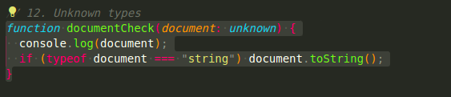

13. Type assertion

    Sometimes we know more about the type of a variable than the TypeScript compiler. In those situations, we can use the as keyword to specify a different type than the one inferred by the compiler. This is called type assertion.

    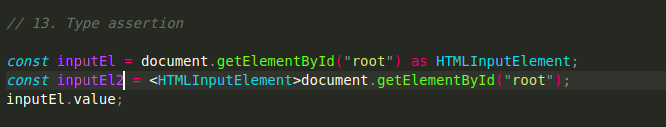

14. Never types

    When a function or a value does not run due to infinite loop we use this type for that function.

    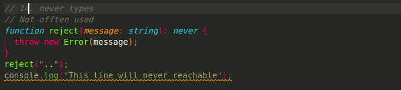
